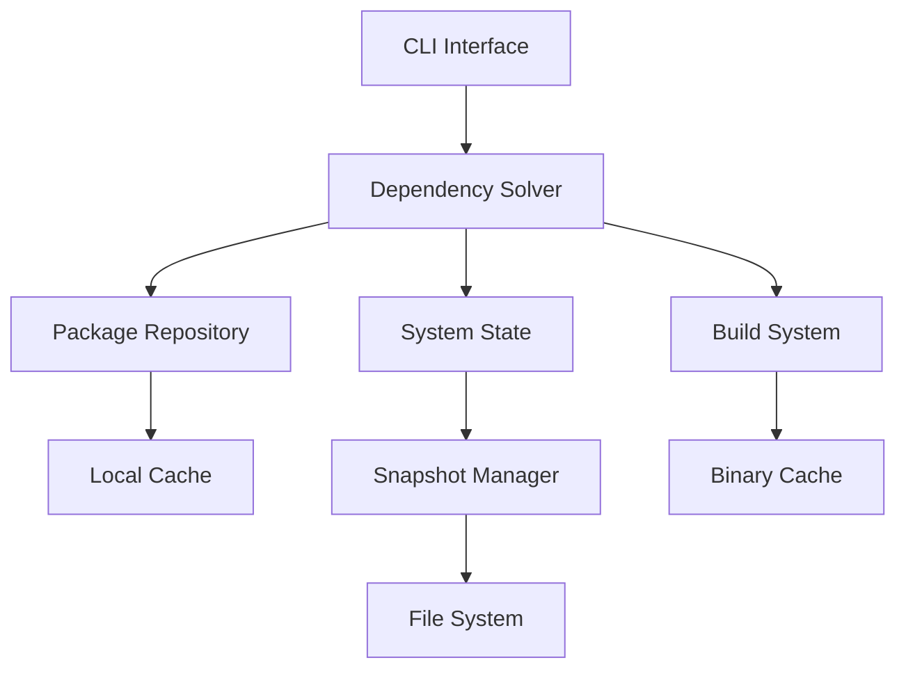

# GPortage - Next-generation Package Manager for Gentoo

[](https://goreportcard.com/report/github.com/kolkov/gportage)
[](https://www.gnu.org/licenses/old-licenses/gpl-2.0.en.html)
[](https://github.com/kolkov/gportage/actions/workflows/build.yml)

**GPortage** is a modern reimplementation of Gentoo's Portage package manager in Go, designed to solve fundamental problems in dependency resolution while maintaining full compatibility with existing Gentoo ecosystems.

## Why GPortage?

Gentoo's traditional package management faces challenges with long-term system upgrades. GPortage solves these problems with:

✅ **SAT-based dependency solver** - Guarantees conflict-free upgrades  
🚀 **Transactional updates** - Snapshot-based rollbacks using Btrfs/ZFS  
🔁 **Incremental sync** - Git-like repository updates  
🔄 **Full Portage compatibility** - Seamless transition from existing systems  
⚡ **Parallel processing** - Optimized for modern multi-core systems  

```bash
# Solve upgrade conflicts that traditional Portage can't handle
gportage resolve --deep-upgrade
```

## Architecture Overview



## Getting Started

### Prerequisites
- Go 1.22+
- Git
- Btrfs or ZFS (for snapshots)

### Installation
```bash
git clone https://github.com/kolkov/gportage.git
cd gportage
make build
sudo make install
```

### Migrating from Portage
```bash
# Convert existing Portage installation
gportage init --convert-portage

# Perform initial system scan
gportage scan-system

# Test upgrade solution
gportage update --dry-run
```

### Basic Usage
```bash
# Install package with SAT resolution
gportage install www-servers/nginx

# Update system with snapshot protection
gportage update --create-snapshot

# Query package information
gportage query dev-lang/go

# Remove package with dependency cleanup
gportage remove net-misc/curl
```

## Key Features

### Advanced Dependency Resolution
```go
// Example constraint solving
solution, err := solver.Resolve(pkg.Constraint{
    Name: "dev-lang/go",
    Version: ">=1.22",
    Slot: "0/1.22",
    UseFlags: []string{"ssl", "-pie"},
})
if err != nil {
    log.Fatal("Resolution failed:", err)
}
```

### Transactional Safety
```bash
# Create pre-upgrade snapshot
gportage snapshot create --tag pre-upgrade-2025

# Rollback if update fails
gportage snapshot restore pre-upgrade-2025

# List available snapshots
gportage snapshot list
```

### Portage Compatibility Layer
```go
// Convert traditional ebuild to native format
pkg, err := compat.ConvertEbuild(
    "/var/db/repos/gentoo/sys-kernel/gentoo-sources/gentoo-sources-6.9.1.ebuild"
)
if err != nil {
    return fmt.Errorf("ebuild conversion failed: %w", err)
}
```

## Development Setup (GoLand)

1. **Clone repository**:
   ```bash
   git clone https://github.com/kolkov/gportage.git
   ```

2. **Open in GoLand**: `File > Open > Select project directory`

3. **Setup build configuration**:
   - Go Build configuration
   - Build command: `make dev-build`
   - Run command: `./bin/gportage --dev-mode`

4. **Enable tests**:
   ```bash
   make test       # Run all tests
   make coverage   # Generate coverage report
   make benchmark  # Run performance benchmarks
   ```

5. **Debugging**:
   - Use the built-in debugger with `debug` build tag
   - Example launch configuration:
   ```json
   {
     "name": "Test Resolver",
     "type": "go",
     "request": "launch",
     "mode": "test",
     "program": "${workspaceFolder}/solver",
     "args": ["-test.run", "TestComplexResolution"]
   }
   ```

## Contributing

We welcome contributions! Please follow our workflow:

1. Fork the repository
2. Create feature branch (`feat/your-feature`)
3. Commit using [Conventional Commits](https://www.conventionalcommits.org/)
4. Submit a PR with detailed description

See our [Contribution Guidelines](CONTRIBUTING.md) for details.

## Roadmap

| Version | Features |
|---------|----------|
| v0.1.0  | Core SAT solver, basic CLI |
| v0.2.0  | Portage compatibility layer |
| v0.3.0  | Snapshot management system |
| v0.4.0  | Parallel build system |
| v1.0.0  | Production-ready release |

## License

GPortage is licensed under the [GNU General Public License v2.0](LICENSE) - the same as original Portage.
